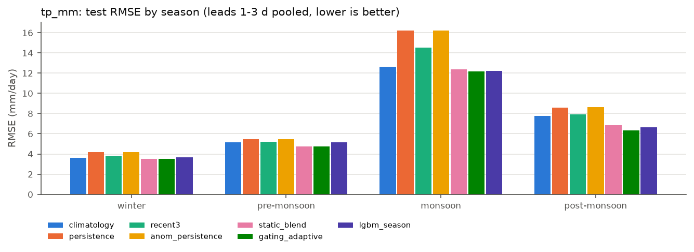
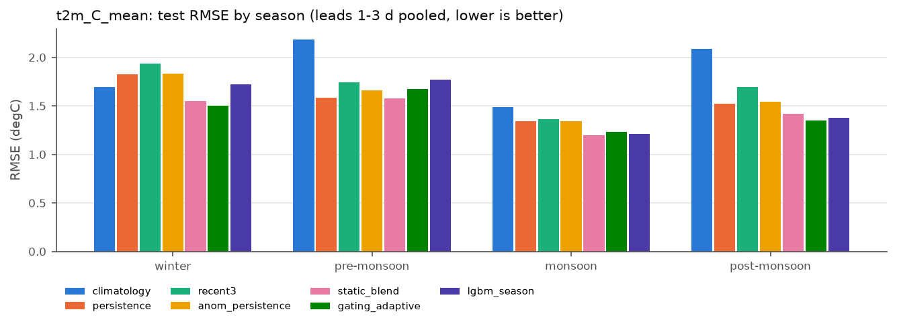
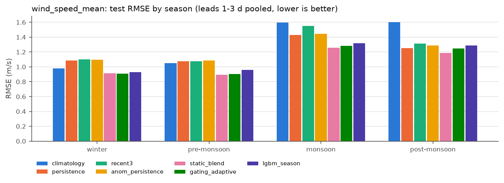
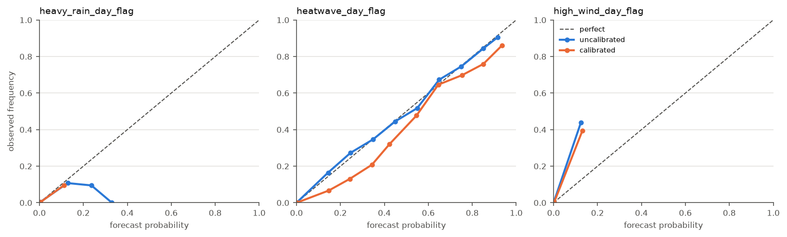
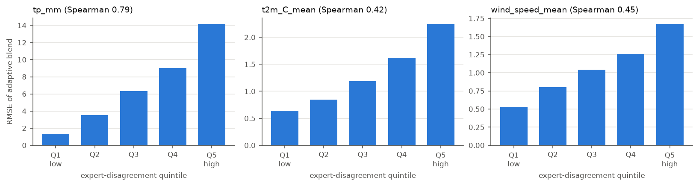
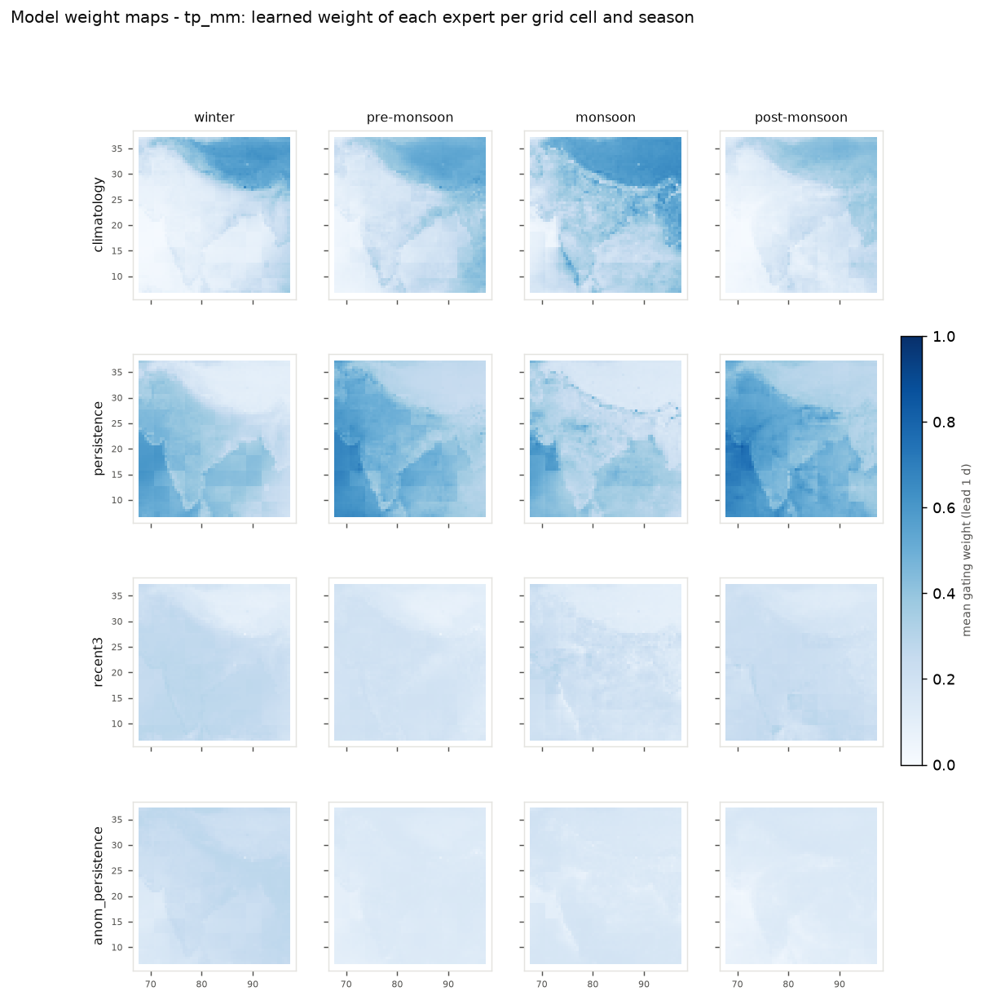
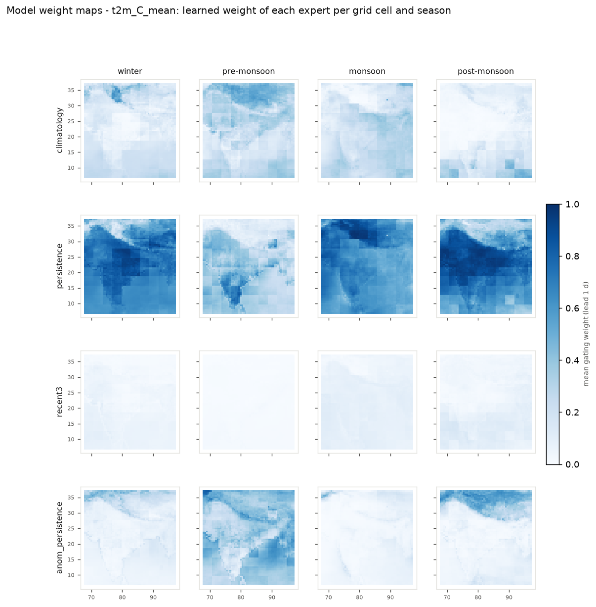
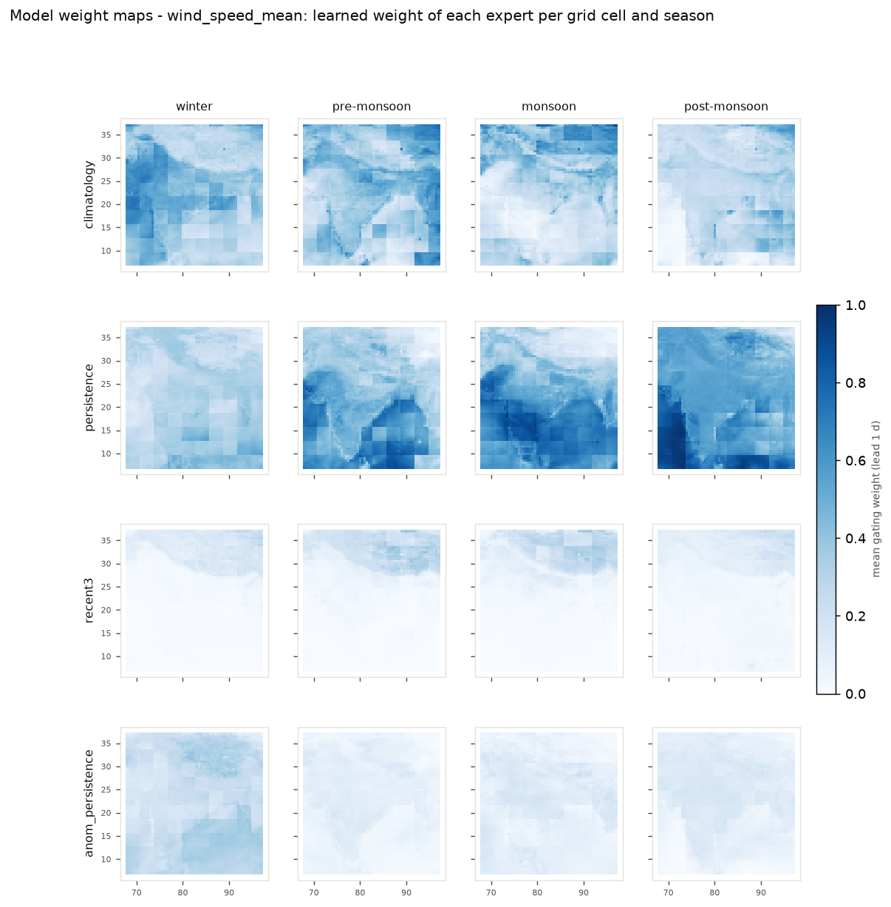

# Hybrid AI-NWP Blending - Model Benchmark Report

_Generated by `python -m scripts.run_pipeline report`. Every number below is read from `reports/results/`. Primary split: **blocked-within-season** (158 train days, embargo 2 d). Test = held-out day blocks, on a 0.5-deg subgrid of real 0.25-deg ERA5 cells (3,599 cells), leads 1-3 days._

## 0. Headline results

| model | season x target slices | beats EVERY expert (RMSE) | beats EVERY expert (MAE) | gain vs best expert CI95 > 0 | median gain vs best expert (RMSE) |
|---|---|---|---|---|---|
| Adaptive gating (b) | 12 | 11 | 10 | 9 | +8.1% |
| Per-season LightGBM (a) | 12 | 7 | 6 | 7 | +4.3% |
| Static blend | 12 | 12 | 10 | 10 | +7.1% |

* **Adaptive gating (b)** is the most accurate point model overall (median RMSE gain over the best single expert per slice: +8.1%).
* The adaptive gating network beats **every** individual expert on RMSE in 11/12 season x target slices. Against the static (season x lead fixed-weight) blend it wins 6/12 slices - so with one year of truth, most of the blending gain comes from learning the right *seasonal* weights; per-row context adaptation adds skill only in some slices (largest in post-monsoon rain and t2m).
* **Time-forward stress test (s.7): skill does NOT transfer to an unseen season for t2m.** With zero post-monsoon training days, all blends lose badly to persistence on Oct-Dec t2m; rain and (for LightGBM/static) wind still beat every expert. Operationally, retrain once every season has been observed.
* Slices where a blend does **not** beat every expert (reported, not hidden): Adaptive gating (b) on t2m_C_mean/pre_monsoon (best expert persistence, -6.1%); Per-season LightGBM (a) on tp_mm/pre_monsoon (best expert climatology, -0.5%); Per-season LightGBM (a) on tp_mm/winter (best expert climatology, -0.9%); Per-season LightGBM (a) on t2m_C_mean/pre_monsoon (best expert persistence, -12.1%); Per-season LightGBM (a) on t2m_C_mean/winter (best expert climatology, -1.9%); Per-season LightGBM (a) on wind_speed_mean/post_monsoon (best expert persistence, -2.9%)
* The raw ECMWF forecast **cannot be benchmarked** with the data in this workspace (section 9c) - every "% improvement over ECMWF" cell is therefore absent rather than invented.

## 1. Data actually used (inventory)

| file | content | dates | size | role |
|---|---|---|---|---|
| data_stream-oper_stepType-{accum,instant}.nc | ERA5 6-hourly 2025, 121x117 grid (7-37N, 68-97E) | 2025-01-01..2025-12-31 | 5,167,305 cell-days | USED: truth archive (rebuilt; the brief's processed csv.gz is absent) |
| forecast_india_2026-09-24_0h_clean.csv (+ .grib2) | ECMWF oper analysis step 0 h | 2026-09-24 | 14,157 points | NOT SCORABLE: tp=0 at step 0, no truth at valid time; optional inference input |
| rainfall_statewise_daily_imd_clean.csv | IMD statewise daily rain: actual/normal/departure | 2026-08-19..2026-09-24 | 40 states/regions | USED: external validation (unseen year) |
| export_meteostat_2025_clean.csv | single station daily 2025 (wpgt column holds shifted pressure values - dropped) | 2025-01-01..2025-12-31 | 365 days | USED: ERA5-vs-gauge check |
| 72d1.../data.grib (6.9 GB) | ERA5 global GRIB1, 1120 msgs: soil temp/moisture, runoff, skt, ssrd, tp | (2025, 1, 31)..(2025, 2, 28) | Feb 2025 only | NOT USED: one month, no new target info |
| model_skill_summary.csv / blended_predictions_2025_Q4_test.csv | earlier prototype, Q4 time split | 2025-10..12 | - | USED: comparison in s.7 |
| blend_framework.py, *_by_season.csv (named in brief) | - | - | - | ABSENT from workspace |

**Split (days per season):**

| season | embargo | test | train | val |
|---|---|---|---|---|
| winter | 8 | 14 | 30 | 7 |
| pre_monsoon | 19 | 21 | 38 | 14 |
| monsoon | 21 | 28 | 52 | 21 |
| post_monsoon | 19 | 21 | 38 | 14 |

Blocks of 7 consecutive days are assigned to train/val/test *within each season* (>= 2 test blocks per season). Train days within 2 days of any val/test day are dropped ("embargo"). Why not a pure time split: the earlier prototype's Q4 hold-out put the whole post-monsoon season in test with zero training days for it, so its climatology had no seasonal information (prototype t2m climatology RMSE 7.23 C). Section 7 reruns our models on exactly that time-forward split as a stress test.

## 2. Point forecasts - per season, per target (test split)

RMSE for each individual source and each blend; % improvement = (baseline - model)/baseline, positive = better. 95% CIs come from a bootstrap over **test days** (500 resamples), because cells on the same day are strongly correlated. Leads 1-3 days pooled; per-lead tables follow.

### tp_mm (mm/day)

| season | Clim RMSE | Persist RMSE | Recent3 RMSE | AnomPers RMSE | Static RMSE | **Gating** RMSE | **LGBM** RMSE | Gating gain vs Clim / Persist / Recent3 / AnomPers | Gating vs best expert (95% CI) | LGBM gain vs Clim / Persist / Recent3 / AnomPers | LGBM vs best expert (95% CI) |
|---|---|---|---|---|---|---|---|---|---|---|---|
| winter | 3.613 | 4.206 | 3.841 | 4.198 | 3.522 | 3.527 | 3.648 | +2.4% / +16.2% / +8.2% / +16.0% | +2.4% [-1.5, +5.2] | -0.9% / +13.3% / +5.0% / +13.1% | -0.9% [-5.1, +1.6] |
| pre_monsoon | 5.155 | 5.443 | 5.208 | 5.459 | 4.768 | 4.743 | 5.178 | +8.0% / +12.9% / +8.9% / +13.1% | +8.0% [+5.6, +11.2] | -0.5% / +4.9% / +0.6% / +5.1% | -0.5% [-2.9, +2.8] |
| monsoon | 12.631 | 16.242 | 14.510 | 16.232 | 12.382 | 12.188 | 12.201 | +3.5% / +25.0% / +16.0% / +24.9% | +3.5% [+2.4, +4.8] | +3.4% / +24.9% / +15.9% / +24.8% | +3.4% [+2.0, +4.9] |
| post_monsoon | 7.757 | 8.569 | 7.942 | 8.635 | 6.840 | 6.324 | 6.625 | +18.5% / +26.2% / +20.4% / +26.8% | +18.5% [+13.4, +26.4] | +14.6% / +22.7% / +16.6% / +23.3% | +14.6% [+9.6, +21.8] |

MAE table

| season | Clim MAE | Persist MAE | Recent3 MAE | AnomPers MAE | static_blend MAE | gating_adaptive MAE | lgbm_season MAE | gating_adaptive MAE gain vs Clim / Persist / Recent3 / AnomPers | lgbm_season MAE gain vs Clim / Persist / Recent3 / AnomPers |
|---|---|---|---|---|---|---|---|---|---|
| winter | 1.095 | 1.094 | 1.095 | 1.092 | 1.040 | 0.979 | 1.169 | +10.6% / +10.5% / +10.6% / +10.4% | -6.8% / -6.9% / -6.7% / -7.0% |
| pre_monsoon | 2.331 | 1.901 | 1.927 | 1.947 | 1.966 | 1.870 | 2.287 | +19.8% / +1.6% / +3.0% / +4.0% | +1.9% / -20.3% / -18.7% / -17.4% |
| monsoon | 7.141 | 8.196 | 7.966 | 8.219 | 6.869 | 6.509 | 6.763 | +8.8% / +20.6% / +18.3% / +20.8% | +5.3% / +17.5% / +15.1% / +17.7% |
| post_monsoon | 3.981 | 2.457 | 2.689 | 2.526 | 3.037 | 2.330 | 3.011 | +41.5% / +5.2% / +13.3% / +7.7% | +24.4% / -22.5% / -12.0% / -19.2% |

### t2m_C_mean (degC)

| season | Clim RMSE | Persist RMSE | Recent3 RMSE | AnomPers RMSE | Static RMSE | **Gating** RMSE | **LGBM** RMSE | Gating gain vs Clim / Persist / Recent3 / AnomPers | Gating vs best expert (95% CI) | LGBM gain vs Clim / Persist / Recent3 / AnomPers | LGBM vs best expert (95% CI) |
|---|---|---|---|---|---|---|---|---|---|---|---|
| winter | 1.692 | 1.827 | 1.936 | 1.831 | 1.548 | 1.504 | 1.724 | +11.1% / +17.7% / +22.3% / +17.9% | +11.1% [+4.8, +18.5] | -1.9% / +5.7% / +11.0% / +5.9% | -1.9% [-10.8, +8.8] |
| pre_monsoon | 2.187 | 1.580 | 1.742 | 1.661 | 1.577 | 1.676 | 1.772 | +23.4% / -6.1% / +3.8% / -0.9% | -6.1% [-17.9, +4.5] | +19.0% / -12.1% / -1.7% / -6.7% | -12.1% [-23.9, -1.2] |
| monsoon | 1.484 | 1.342 | 1.365 | 1.345 | 1.201 | 1.230 | 1.210 | +17.1% / +8.3% / +9.9% / +8.5% | +8.3% [+5.3, +11.1] | +18.5% / +9.8% / +11.4% / +10.0% | +9.8% [+7.5, +12.2] |
| post_monsoon | 2.084 | 1.523 | 1.695 | 1.544 | 1.421 | 1.351 | 1.377 | +35.2% / +11.3% / +20.3% / +12.5% | +11.3% [+6.7, +16.0] | +33.9% / +9.6% / +18.8% / +10.8% | +9.6% [+5.4, +13.5] |

MAE table

| season | Clim MAE | Persist MAE | Recent3 MAE | AnomPers MAE | static_blend MAE | gating_adaptive MAE | lgbm_season MAE | gating_adaptive MAE gain vs Clim / Persist / Recent3 / AnomPers | lgbm_season MAE gain vs Clim / Persist / Recent3 / AnomPers |
|---|---|---|---|---|---|---|---|---|---|
| winter | 1.086 | 1.086 | 1.160 | 1.091 | 0.932 | 0.929 | 1.119 | +14.4% / +14.4% / +19.9% / +14.8% | -3.1% / -3.1% / +3.5% / -2.6% |
| pre_monsoon | 1.485 | 1.071 | 1.207 | 1.114 | 1.046 | 1.086 | 1.171 | +26.8% / -1.4% / +10.0% / +2.5% | +21.1% / -9.3% / +3.0% / -5.1% |
| monsoon | 1.014 | 0.905 | 0.939 | 0.908 | 0.816 | 0.831 | 0.829 | +18.0% / +8.2% / +11.5% / +8.5% | +18.2% / +8.4% / +11.7% / +8.8% |
| post_monsoon | 1.394 | 0.999 | 1.153 | 1.015 | 0.945 | 0.907 | 0.924 | +34.9% / +9.2% / +21.3% / +10.6% | +33.7% / +7.5% / +19.9% / +9.0% |

### wind_speed_mean (m/s)

| season | Clim RMSE | Persist RMSE | Recent3 RMSE | AnomPers RMSE | Static RMSE | **Gating** RMSE | **LGBM** RMSE | Gating gain vs Clim / Persist / Recent3 / AnomPers | Gating vs best expert (95% CI) | LGBM gain vs Clim / Persist / Recent3 / AnomPers | LGBM vs best expert (95% CI) |
|---|---|---|---|---|---|---|---|---|---|---|---|
| winter | 0.979 | 1.086 | 1.101 | 1.094 | 0.913 | 0.907 | 0.928 | +7.3% / +16.5% / +17.7% / +17.1% | +7.3% [+3.7, +10.6] | +5.2% / +14.5% / +15.8% / +15.2% | +5.2% [+2.1, +7.9] |
| pre_monsoon | 1.049 | 1.074 | 1.077 | 1.086 | 0.895 | 0.905 | 0.960 | +13.7% / +15.8% / +15.9% / +16.6% | +13.7% [+11.3, +15.8] | +8.5% / +10.6% / +10.8% / +11.6% | +8.5% [+5.3, +11.1] |
| monsoon | 1.597 | 1.427 | 1.551 | 1.442 | 1.257 | 1.281 | 1.319 | +19.8% / +10.3% / +17.4% / +11.2% | +10.3% [+5.5, +15.4] | +17.4% / +7.6% / +14.9% / +8.5% | +7.6% [+0.7, +14.8] |
| post_monsoon | 1.603 | 1.252 | 1.314 | 1.286 | 1.188 | 1.249 | 1.289 | +22.1% / +0.2% / +4.9% / +2.8% | +0.2% [-5.7, +5.6] | +19.6% / -2.9% / +1.9% / -0.2% | -2.9% [-10.8, +3.7] |

MAE table

| season | Clim MAE | Persist MAE | Recent3 MAE | AnomPers MAE | static_blend MAE | gating_adaptive MAE | lgbm_season MAE | gating_adaptive MAE gain vs Clim / Persist / Recent3 / AnomPers | lgbm_season MAE gain vs Clim / Persist / Recent3 / AnomPers |
|---|---|---|---|---|---|---|---|---|---|
| winter | 0.685 | 0.748 | 0.751 | 0.753 | 0.631 | 0.626 | 0.647 | +8.6% / +16.2% / +16.6% / +16.8% | +5.6% / +13.5% / +13.9% / +14.1% |
| pre_monsoon | 0.773 | 0.764 | 0.771 | 0.772 | 0.648 | 0.657 | 0.696 | +15.1% / +14.0% / +14.8% / +14.9% | +10.0% / +8.9% / +9.7% / +9.9% |
| monsoon | 1.111 | 0.977 | 1.052 | 0.986 | 0.859 | 0.885 | 0.910 | +20.3% / +9.4% / +15.9% / +10.2% | +18.0% / +6.8% / +13.5% / +7.7% |
| post_monsoon | 1.064 | 0.807 | 0.859 | 0.826 | 0.771 | 0.808 | 0.846 | +24.1% / -0.1% / +6.0% / +2.2% | +20.5% / -4.9% / +1.5% / -2.4% |

### All seasons pooled

| target | anom_persistence | climatology | gating_adaptive | lgbm_season | persistence | quantile_median | recent3 | static_blend |
|---|---|---|---|---|---|---|---|---|
| t2m_C_mean | 1.565 | 1.869 | 1.428 | 1.497 | 1.536 | 1.424 | 1.650 | 1.417 |
| tp_mm | 10.810 | 8.778 | 8.198 | 8.338 | 10.800 | 8.556 | 9.756 | 8.400 |
| wind_speed_mean | 1.265 | 1.389 | 1.131 | 1.170 | 1.247 | 1.130 | 1.313 | 1.104 |

### By lead time (RMSE gain vs best expert in each season x lead slice)

| target | season | Gating lead 1d | LGBM lead 1d | Gating lead 2d | LGBM lead 2d | Gating lead 3d | LGBM lead 3d |
|---|---|---|---|---|---|---|---|
| t2m_C_mean | monsoon | 0.948 (+3.9%, best=Persist) | 0.975 (+1.2%, best=Persist) | 1.282 (+7.8%, best=Persist) | 1.247 (+10.2%, best=Persist) | 1.414 (+4.7%, best=Clim) | 1.373 (+7.5%, best=Clim) |
| t2m_C_mean | post_monsoon | 0.971 (+6.8%, best=Persist) | 1.027 (+1.4%, best=Persist) | 1.357 (+12.1%, best=Persist) | 1.391 (+9.9%, best=Persist) | 1.641 (+12.2%, best=Persist) | 1.644 (+12.0%, best=Persist) |
| t2m_C_mean | pre_monsoon | 1.223 (-10.3%, best=Persist) | 1.500 (-35.3%, best=Persist) | 1.763 (-9.8%, best=Persist) | 1.823 (-13.5%, best=Persist) | 1.955 (-1.9%, best=Persist) | 1.960 (-2.1%, best=Persist) |
| t2m_C_mean | winter | 1.182 (+9.2%, best=Persist) | 1.490 (-14.4%, best=Persist) | 1.557 (+8.0%, best=Clim) | 1.750 (-3.4%, best=Clim) | 1.723 (-1.8%, best=Clim) | 1.905 (-12.6%, best=Clim) |
| tp_mm | monsoon | 11.551 (+8.6%, best=Clim) | 11.619 (+8.0%, best=Clim) | 12.409 (+1.8%, best=Clim) | 12.378 (+2.0%, best=Clim) | 12.579 (+0.4%, best=Clim) | 12.584 (+0.4%, best=Clim) |
| tp_mm | post_monsoon | 5.837 (+15.5%, best=Persist) | 6.120 (+11.4%, best=Persist) | 6.449 (+16.9%, best=Clim) | 6.762 (+12.8%, best=Clim) | 6.658 (+14.2%, best=Clim) | 6.965 (+10.2%, best=Clim) |
| tp_mm | pre_monsoon | 4.406 (+7.0%, best=Recent3) | 5.066 (-6.9%, best=Recent3) | 4.820 (+6.5%, best=Clim) | 5.255 (-2.0%, best=Clim) | 4.984 (+3.3%, best=Clim) | 5.212 (-1.1%, best=Clim) |
| tp_mm | winter | 3.345 (+7.4%, best=Clim) | 3.498 (+3.2%, best=Clim) | 3.615 (-0.0%, best=Clim) | 3.708 (-2.6%, best=Clim) | 3.614 (-0.0%, best=Clim) | 3.732 (-3.3%, best=Clim) |
| wind_speed_mean | monsoon | 0.948 (+4.8%, best=Persist) | 1.017 (-2.1%, best=Persist) | 1.332 (+8.8%, best=Persist) | 1.346 (+7.8%, best=Persist) | 1.500 (+6.1%, best=Clim) | 1.541 (+3.5%, best=Clim) |
| wind_speed_mean | post_monsoon | 0.917 (-1.7%, best=Persist) | 0.955 (-6.0%, best=Persist) | 1.318 (-2.9%, best=Persist) | 1.334 (-4.3%, best=Persist) | 1.451 (+2.3%, best=Recent3) | 1.513 (-1.8%, best=Recent3) |
| wind_speed_mean | pre_monsoon | 0.760 (+9.2%, best=Persist) | 0.819 (+2.1%, best=Persist) | 0.938 (+10.6%, best=Clim) | 0.998 (+4.8%, best=Clim) | 1.000 (+4.7%, best=Clim) | 1.048 (+0.1%, best=Clim) |
| wind_speed_mean | winter | 0.768 (+7.1%, best=Persist) | 0.799 (+3.4%, best=Persist) | 0.956 (+2.3%, best=Clim) | 0.972 (+0.7%, best=Clim) | 0.982 (-0.3%, best=Clim) | 1.000 (-2.2%, best=Clim) |

### By weather regime (all seasons, adaptive gating vs every expert)

| target | regime | n | rmse | best_expert | rmse_gain_vs_climatology_% | rmse_gain_vs_persistence_% | rmse_gain_vs_recent3_% | rmse_gain_vs_anom_persistence_% | beats_every_expert_rmse |
|---|---|---|---|---|---|---|---|---|---|
| tp_mm | cyclonic | 19,846 | 8.26 | climatology | 10.13 | 51.34 | 44.30 | 51.02 | yes |
| tp_mm | dry_spell | 183,834 | 2.05 | anom_persistence | 9.39 | 1.59 | 1.69 | 1.44 | yes |
| tp_mm | heatwave | 3,342 | 1.87 | anom_persistence | 7.01 | 4.73 | 5.84 | 4.07 | yes |
| tp_mm | monsoon | 133,493 | 14.77 | climatology | 3.54 | 28.87 | 17.40 | 28.86 | yes |
| tp_mm | normal | 510,084 | 6.44 | persistence | 9.74 | 5.72 | 5.94 | 5.78 | yes |
| tp_mm | wet_spell | 56,349 | 12.33 | climatology | 7.47 | 30.87 | 23.36 | 31.37 | yes |
| t2m_C_mean | cyclonic | 19,846 | 1.78 | climatology | 1.62 | 26.44 | 28.20 | 27.19 | yes |
| t2m_C_mean | dry_spell | 183,834 | 1.60 | persistence | 25.22 | 8.37 | 16.79 | 10.84 | yes |
| t2m_C_mean | heatwave | 3,342 | 1.52 | persistence | 46.06 | 10.05 | 23.55 | 17.22 | yes |
| t2m_C_mean | monsoon | 133,493 | 1.16 | persistence | 17.73 | 9.36 | 13.30 | 9.79 | yes |
| t2m_C_mean | normal | 510,084 | 1.43 | persistence | 24.14 | 3.25 | 9.36 | 4.87 | yes |
| t2m_C_mean | wet_spell | 56,349 | 1.22 | persistence | 25.71 | 15.97 | 23.47 | 17.24 | yes |
| wind_speed_mean | cyclonic | 19,846 | 1.98 | persistence | 32.61 | 14.04 | 24.26 | 14.21 | yes |
| wind_speed_mean | dry_spell | 183,834 | 0.72 | climatology | 8.47 | 16.88 | 16.57 | 17.30 | yes |
| wind_speed_mean | heatwave | 3,342 | 1.00 | climatology | 7.06 | 18.00 | 19.19 | 18.50 | yes |
| wind_speed_mean | monsoon | 133,493 | 1.30 | persistence | 13.88 | 9.61 | 14.14 | 10.31 | yes |
| wind_speed_mean | normal | 510,084 | 1.12 | persistence | 19.28 | 8.25 | 12.13 | 9.91 | yes |
| wind_speed_mean | wet_spell | 56,349 | 1.43 | persistence | 17.38 | 3.40 | 11.83 | 5.72 | yes |

## 3. Spatial generalisation - cells never seen in training

1200 random 0.25-deg cells *off* the training subgrid, same test days. Similar gains here mean the models are not memorising cell identity.

| target | season | Gating RMSE | Gating gain vs best expert | Gating beats every expert | LGBM RMSE | LGBM gain vs best expert | LGBM beats every expert | (subgrid Gating gain, for reference) |
|---|---|---|---|---|---|---|---|---|
| t2m_C_mean | monsoon | 1.228 | +8.1% | yes | 1.206 | +9.7% | yes | +8.3% |
| t2m_C_mean | post_monsoon | 1.360 | +11.5% | yes | 1.372 | +10.7% | yes | +11.3% |
| t2m_C_mean | pre_monsoon | 1.668 | -5.8% | **NO** | 1.750 | -10.9% | **NO** | -6.1% |
| t2m_C_mean | winter | 1.495 | +11.2% | yes | 1.707 | -1.4% | **NO** | +11.1% |
| tp_mm | monsoon | 12.490 | +3.3% | yes | 12.475 | +3.4% | yes | +3.5% |
| tp_mm | post_monsoon | 6.463 | +17.6% | yes | 6.772 | +13.6% | yes | +18.5% |
| tp_mm | pre_monsoon | 4.777 | +7.6% | yes | 5.240 | -1.3% | **NO** | +8.0% |
| tp_mm | winter | 3.437 | +2.2% | yes | 3.550 | -1.0% | **NO** | +2.4% |
| wind_speed_mean | monsoon | 1.272 | +10.2% | yes | 1.316 | +7.0% | yes | +10.3% |
| wind_speed_mean | post_monsoon | 1.241 | +0.1% | yes | 1.279 | -3.0% | **NO** | +0.2% |
| wind_speed_mean | pre_monsoon | 0.893 | +12.9% | yes | 0.954 | +6.9% | yes | +13.7% |
| wind_speed_mean | winter | 0.887 | +7.0% | yes | 0.904 | +5.3% | yes | +7.3% |

## 4. Uncertainty - quantile regression on top of the blend (c)

LightGBM quantile models at levels [0.05, 0.1, 0.25, 0.5, 0.75, 0.9, 0.95]; inputs = features + adaptive blend + expert spread. CRPS is approximated as 2 x mean pinball loss over the 7 levels (same estimator for model and baselines). Baselines: per-cell x season climatological quantiles (train days), and persistence + train residual quantiles. Intervals are split-conformalised per season on the validation days (CQR) - both raw and conformalised coverage are shown.

| target | season | crps_model | crps_clim_quantiles | crpss_vs_clim_quantiles_% | crps_persistence_resid | crpss_vs_persistence_resid_% | pinball_q10 | pinball_q50 | pinball_q90 | cov80_raw | cov80_cqr | cov90_raw | cov90_cqr | width80_cqr | cov80_clim |
|---|---|---|---|---|---|---|---|---|---|---|---|---|---|---|---|
| tp_mm | winter | 0.642 | 0.737 | 12.869 | 1.007 | 36.244 | 0.095 | 0.438 | 0.486 | 0.855 | 0.855 | 0.937 | 0.937 | 1.923 | 0.851 |
| tp_mm | pre_monsoon | 1.091 | 1.362 | 19.930 | 1.530 | 28.715 | 0.188 | 0.802 | 0.769 | 0.841 | 0.853 | 0.941 | 0.941 | 5.034 | 0.837 |
| tp_mm | monsoon | 3.881 | 4.206 | 7.713 | 5.645 | 31.248 | 0.761 | 3.037 | 2.499 | 0.772 | 0.794 | 0.887 | 0.898 | 16.757 | 0.752 |
| tp_mm | post_monsoon | 1.253 | 1.522 | 17.702 | 2.043 | 38.693 | 0.177 | 0.849 | 0.971 | 0.795 | 0.795 | 0.919 | 0.919 | 7.434 | 0.910 |
| tp_mm | ALL | 1.987 | 2.246 | 11.540 | 2.943 | 32.496 | 0.361 | 1.498 | 1.349 | 0.809 | 0.819 | 0.917 | 0.920 | 9.023 | 0.829 |
| t2m_C_mean | winter | 0.565 | 0.891 | 36.559 | 0.751 | 24.794 | 0.246 | 0.475 | 0.206 | 0.795 | 0.813 | 0.886 | 0.904 | 3.117 | 0.640 |
| t2m_C_mean | pre_monsoon | 0.652 | 1.276 | 48.877 | 0.695 | 6.152 | 0.307 | 0.552 | 0.217 | 0.726 | 0.781 | 0.847 | 0.890 | 3.107 | 0.769 |
| t2m_C_mean | monsoon | 0.480 | 0.680 | 29.440 | 0.581 | 17.346 | 0.209 | 0.414 | 0.167 | 0.737 | 0.832 | 0.849 | 0.923 | 2.676 | 0.770 |
| t2m_C_mean | post_monsoon | 0.522 | 1.230 | 57.553 | 0.637 | 18.030 | 0.225 | 0.447 | 0.186 | 0.756 | 0.748 | 0.867 | 0.868 | 2.484 | 0.822 |
| t2m_C_mean | ALL | 0.548 | 1.002 | 45.313 | 0.652 | 15.960 | 0.244 | 0.467 | 0.191 | 0.748 | 0.795 | 0.859 | 0.898 | 2.809 | 0.761 |
| wind_speed_mean | winter | 0.363 | 0.399 | 9.059 | 0.478 | 24.081 | 0.125 | 0.307 | 0.165 | 0.800 | 0.847 | 0.891 | 0.925 | 2.194 | 0.751 |
| wind_speed_mean | pre_monsoon | 0.377 | 0.448 | 15.878 | 0.480 | 21.416 | 0.138 | 0.324 | 0.160 | 0.807 | 0.925 | 0.901 | 0.985 | 2.937 | 0.771 |
| wind_speed_mean | monsoon | 0.531 | 0.650 | 18.299 | 0.619 | 14.285 | 0.175 | 0.446 | 0.252 | 0.725 | 0.773 | 0.829 | 0.873 | 2.459 | 0.743 |
| wind_speed_mean | post_monsoon | 0.488 | 0.586 | 16.730 | 0.538 | 9.291 | 0.204 | 0.397 | 0.199 | 0.741 | 0.704 | 0.839 | 0.816 | 2.014 | 0.723 |
| wind_speed_mean | ALL | 0.454 | 0.542 | 16.239 | 0.541 | 16.068 | 0.165 | 0.380 | 0.201 | 0.762 | 0.806 | 0.860 | 0.895 | 2.423 | 0.746 |

Target: cov80 ~ 0.80, cov90 ~ 0.90. `crpss_*` > 0 means the quantile model beats that probabilistic baseline.

## 5. Extreme-event classifiers (d) - calibrated probabilities

Labels: heavy rain = daily tp >= 64.5 mm (IMD 'heavy'); heatwave = land cell with daily max of 6-hourly t2m >= 40.0 C (IMD plains absolute criterion; 6-hourly sampling under-reads the true Tmax); high wind = daily max 10 m wind >= 13.9 m/s (Beaufort 7). LightGBM + isotonic calibration on validation days. Reference: 'persistence_flag' = the event happened on the issue day. **Trust rule:** a slice is marked untrusted if it has < 50 positives or positives on < 5 distinct days (grid cells on one day are not independent events).

### All leads pooled

| flag | season | model | n_pos | pos_days | trusted | auc | avg_precision | brier_skill_vs_climo | precision@0.2 | recall@0.2 | precision@0.5 | recall@0.5 |
|---|---|---|---|---|---|---|---|---|---|---|---|---|
| heavy_rain_day_flag | winter | calibrated | 24 | 5 | **NO** | 0.858 | 0.001 | -0.022 | - | 0.000 | - | 0.000 |
| heavy_rain_day_flag | winter | persistence_flag | 24 | 5 | **NO** | 0.500 | 0.000 | -0.875 | 0.000 | 0.000 | 0.000 | 0.000 |
| heavy_rain_day_flag | pre_monsoon | calibrated | 132 | 13 | yes | 0.885 | 0.008 | -0.042 | - | 0.000 | - | 0.000 |
| heavy_rain_day_flag | pre_monsoon | persistence_flag | 132 | 13 | yes | 0.523 | 0.004 | -0.440 | 0.086 | 0.045 | 0.086 | 0.045 |
| heavy_rain_day_flag | monsoon | calibrated | 2,664 | 28 | yes | 0.810 | 0.032 | 0.011 | - | 0.000 | - | 0.000 |
| heavy_rain_day_flag | monsoon | persistence_flag | 2,664 | 28 | yes | 0.525 | 0.011 | -0.988 | 0.054 | 0.058 | 0.054 | 0.058 |
| heavy_rain_day_flag | post_monsoon | calibrated | 528 | 13 | yes | 0.932 | 0.099 | 0.046 | - | 0.000 | - | 0.000 |
| heavy_rain_day_flag | post_monsoon | persistence_flag | 528 | 13 | yes | 0.558 | 0.013 | -1.024 | 0.095 | 0.119 | 0.095 | 0.119 |
| heavy_rain_day_flag | ALL | calibrated | 3,348 | 59 | yes | 0.904 | 0.037 | 0.018 | - | 0.000 | - | 0.000 |
| heavy_rain_day_flag | ALL | persistence_flag | 3,348 | 59 | yes | 0.532 | 0.008 | -0.964 | 0.061 | 0.067 | 0.061 | 0.067 |
| heatwave_day_flag | winter | calibrated | 0 | 0 | **NO** | - | - | - | - | - | - | - |
| heatwave_day_flag | winter | persistence_flag | 0 | 0 | **NO** | - | - | - | - | - | - | - |
| heatwave_day_flag | pre_monsoon | calibrated | 4,062 | 12 | yes | 0.992 | 0.714 | 0.512 | 0.430 | 0.917 | 0.716 | 0.621 |
| heatwave_day_flag | pre_monsoon | persistence_flag | 4,062 | 12 | yes | 0.742 | 0.450 | 0.426 | 0.908 | 0.485 | 0.908 | 0.485 |
| heatwave_day_flag | monsoon | calibrated | 1,173 | 22 | yes | 0.994 | 0.360 | 0.113 | 0.222 | 0.835 | 0.398 | 0.347 |
| heatwave_day_flag | monsoon | persistence_flag | 1,173 | 22 | yes | 0.700 | 0.165 | -0.197 | 0.404 | 0.403 | 0.404 | 0.403 |
| heatwave_day_flag | post_monsoon | calibrated | 0 | 0 | **NO** | - | - | - | - | - | - | - |
| heatwave_day_flag | post_monsoon | persistence_flag | 0 | 0 | **NO** | - | - | - | - | - | - | - |
| heatwave_day_flag | ALL | calibrated | 5,235 | 34 | yes | 0.996 | 0.639 | 0.427 | 0.360 | 0.899 | 0.644 | 0.560 |
| heatwave_day_flag | ALL | persistence_flag | 5,235 | 34 | yes | 0.733 | 0.344 | 0.291 | 0.731 | 0.467 | 0.731 | 0.467 |
| high_wind_day_flag | winter | calibrated | 21 | 2 | **NO** | 0.997 | 0.029 | -0.474 | - | 0.000 | - | 0.000 |
| high_wind_day_flag | winter | persistence_flag | 21 | 2 | **NO** | 0.524 | 0.001 | -2.524 | 0.018 | 0.048 | 0.018 | 0.048 |
| high_wind_day_flag | pre_monsoon | calibrated | 189 | 3 | **NO** | 0.990 | 0.062 | 0.039 | - | 0.000 | - | 0.000 |
| high_wind_day_flag | pre_monsoon | persistence_flag | 189 | 3 | **NO** | 0.571 | 0.015 | -1.192 | 0.097 | 0.143 | 0.097 | 0.143 |
| high_wind_day_flag | monsoon | calibrated | 2,370 | 10 | yes | 0.956 | 0.119 | 0.054 | - | 0.000 | - | 0.000 |
| high_wind_day_flag | monsoon | persistence_flag | 2,370 | 10 | yes | 0.599 | 0.048 | -0.605 | 0.205 | 0.205 | 0.205 | 0.205 |
| high_wind_day_flag | post_monsoon | calibrated | 330 | 8 | yes | 0.935 | 0.014 | -0.019 | - | 0.000 | - | 0.000 |
| high_wind_day_flag | post_monsoon | persistence_flag | 330 | 8 | yes | 0.558 | 0.016 | -0.742 | 0.121 | 0.118 | 0.121 | 0.118 |
| high_wind_day_flag | ALL | calibrated | 2,910 | 23 | yes | 0.968 | 0.071 | 0.044 | - | 0.000 | - | 0.000 |
| high_wind_day_flag | ALL | persistence_flag | 2,910 | 23 | yes | 0.594 | 0.037 | -0.667 | 0.182 | 0.190 | 0.182 | 0.190 |

**Untrustworthy slices (too few positives / event days):** heavy_rain_day_flag / winter (24 positives on 5 days), heatwave_day_flag / winter (0 positives on 0 days), heatwave_day_flag / post_monsoon (0 positives on 0 days), high_wind_day_flag / winter (21 positives on 2 days), high_wind_day_flag / pre_monsoon (189 positives on 3 days).

### By lead (all seasons, calibrated)

| flag | lead | n_pos | pos_days | trusted | auc | avg_precision | brier_skill_vs_climo | precision@0.2 | recall@0.2 | precision@0.5 | recall@0.5 |
|---|---|---|---|---|---|---|---|---|---|---|---|
| heavy_rain_day_flag | 1 | 1,116 | 59 | yes | 0.933 | 0.059 | 0.033 | - | 0.000 | - | 0.000 |
| heavy_rain_day_flag | 2 | 1,116 | 59 | yes | 0.896 | 0.030 | 0.013 | - | 0.000 | - | 0.000 |
| heavy_rain_day_flag | 3 | 1,116 | 59 | yes | 0.882 | 0.024 | 0.007 | - | 0.000 | - | 0.000 |
| heatwave_day_flag | 1 | 1,745 | 34 | yes | 0.998 | 0.759 | 0.537 | 0.404 | 0.950 | 0.710 | 0.669 |
| heatwave_day_flag | 2 | 1,745 | 34 | yes | 0.996 | 0.597 | 0.398 | 0.350 | 0.903 | 0.614 | 0.547 |
| heatwave_day_flag | 3 | 1,745 | 34 | yes | 0.994 | 0.536 | 0.345 | 0.329 | 0.844 | 0.599 | 0.464 |
| high_wind_day_flag | 1 | 970 | 23 | yes | 0.984 | 0.154 | 0.067 | - | 0.000 | - | 0.000 |
| high_wind_day_flag | 2 | 970 | 23 | yes | 0.965 | 0.058 | 0.039 | - | 0.000 | - | 0.000 |
| high_wind_day_flag | 3 | 970 | 23 | yes | 0.950 | 0.036 | 0.026 | - | 0.000 | - | 0.000 |

## 6. Model-disagreement signal (e)

`expert_spread` = standard deviation of the 4 expert forecasts per cell/day (logged in every prediction row, and fed to the quantile model). Is it informative? Error of the adaptive blend by spread quintile:

| target | season | spearman_spread_vs_abs_err | Q1_rmse | Q3_rmse | Q5_rmse | rmse_ratio_top_vs_bottom_quintile | Q1_width80 | Q5_width80 | Q1_cov80 | Q5_cov80 |
|---|---|---|---|---|---|---|---|---|---|---|
| tp_mm | winter | 0.897 | 0.724 | 1.424 | 7.004 | 9.671 | 0.089 | 6.714 | 0.974 | 0.763 |
| tp_mm | pre_monsoon | 0.790 | 1.578 | 3.533 | 8.258 | 5.234 | 0.405 | 12.122 | 0.929 | 0.795 |
| tp_mm | monsoon | 0.471 | 6.480 | 11.584 | 17.205 | 2.655 | 7.215 | 26.887 | 0.804 | 0.773 |
| tp_mm | post_monsoon | 0.774 | 1.012 | 5.043 | 11.230 | 11.096 | 1.140 | 15.187 | 0.913 | 0.757 |
| tp_mm | ALL | 0.788 | 1.335 | 6.308 | 14.171 | 10.616 | 0.507 | 20.769 | 0.917 | 0.774 |
| t2m_C_mean | winter | 0.452 | 0.591 | 1.040 | 2.615 | 4.424 | 1.504 | 5.541 | 0.798 | 0.764 |
| t2m_C_mean | pre_monsoon | 0.454 | 0.686 | 1.504 | 2.634 | 3.838 | 1.688 | 4.551 | 0.865 | 0.688 |
| t2m_C_mean | monsoon | 0.393 | 0.655 | 1.045 | 1.843 | 2.815 | 1.701 | 3.895 | 0.891 | 0.760 |
| t2m_C_mean | post_monsoon | 0.390 | 0.623 | 1.233 | 1.978 | 3.172 | 1.489 | 4.095 | 0.806 | 0.738 |
| t2m_C_mean | ALL | 0.423 | 0.641 | 1.183 | 2.247 | 3.507 | 1.624 | 4.359 | 0.851 | 0.728 |
| wind_speed_mean | winter | 0.359 | 0.523 | 0.930 | 1.132 | 2.164 | 1.309 | 3.114 | 0.888 | 0.837 |
| wind_speed_mean | pre_monsoon | 0.345 | 0.554 | 0.908 | 1.165 | 2.103 | 2.051 | 3.735 | 0.963 | 0.897 |
| wind_speed_mean | monsoon | 0.450 | 0.574 | 1.224 | 1.829 | 3.190 | 1.413 | 3.139 | 0.901 | 0.624 |
| wind_speed_mean | post_monsoon | 0.534 | 0.463 | 1.068 | 1.931 | 4.166 | 0.934 | 2.983 | 0.793 | 0.565 |
| wind_speed_mean | ALL | 0.446 | 0.531 | 1.041 | 1.673 | 3.151 | 1.408 | 3.204 | 0.884 | 0.683 |

## 7. Stress test - time-forward split (train Jan-Aug, val Sep, test Oct-Dec)

Same features/models, but the prototype's split. Post-monsoon has **no training days**, so per-season LightGBM falls back to one all-season model, and climatology has to borrow from the nearest train days. This quantifies how much of the headline skill survives a pure out-of-time test.

| target | season | anom_persistence | climatology | gating_adaptive | lgbm_season | persistence | recent3 | static_blend |
|---|---|---|---|---|---|---|---|---|
| t2m_C_mean | post_monsoon | 1.493 | 9.612 | 5.640 | 4.308 | 1.463 | 1.559 | 3.896 |
| tp_mm | post_monsoon | 9.834 | 11.428 | 8.288 | 7.821 | 9.814 | 8.931 | 8.527 |
| wind_speed_mean | post_monsoon | 1.350 | 2.276 | 1.454 | 1.269 | 1.337 | 1.397 | 1.288 |

| target | season | blend | rmse | best_expert | rmse_gain_vs_best_% | gain_vs_best_ci95_lo | gain_vs_best_ci95_hi | beats_every_expert_rmse |
|---|---|---|---|---|---|---|---|---|
| tp_mm | post_monsoon | gating_adaptive | 8.288 | recent3 | 7.197 | 5.004 | 9.495 | yes |
| tp_mm | post_monsoon | lgbm_season | 7.821 | recent3 | 12.432 | 7.985 | 17.125 | yes |
| tp_mm | post_monsoon | static_blend | 8.527 | recent3 | 4.523 | 3.033 | 5.970 | yes |
| t2m_C_mean | post_monsoon | gating_adaptive | 5.640 | persistence | -285.528 | -318.364 | -257.035 | **NO** |
| t2m_C_mean | post_monsoon | lgbm_season | 4.308 | persistence | -194.461 | -216.428 | -175.602 | **NO** |
| t2m_C_mean | post_monsoon | static_blend | 3.896 | persistence | -166.292 | -183.545 | -150.668 | **NO** |
| wind_speed_mean | post_monsoon | gating_adaptive | 1.454 | persistence | -8.803 | -14.527 | -4.388 | **NO** |
| wind_speed_mean | post_monsoon | lgbm_season | 1.269 | persistence | 5.088 | 1.036 | 8.579 | yes |
| wind_speed_mean | post_monsoon | static_blend | 1.288 | persistence | 3.661 | 0.855 | 6.114 | yes |

**Comparison with the earlier prototype (same Oct-Dec test window, lead 1 d persistence setting):**

| target | BLENDED | Climatology | Persistence |
|---|---|---|---|
| t2m_C_mean | 1.575 | 7.233 | 1.268 |
| tp_mm | 1.026 | 1.103 | 1.055 |
| wind_speed_mean | 0.677 | 0.930 | 0.645 |

The prototype's blend lost to persistence on t2m (1.575 vs 1.268) and wind (0.677 vs 0.645). Its tp values are ~6x smaller than a physical daily total (it appears to sum four 1-hour accumulations instead of scaling to 24 h), so tp numbers are not comparable across the two.

## 8. Model weight maps (interpretability deliverable)

Mean softmax weight the adaptive gating network gives each expert. Full per-region table: `reports/results/blocked/w_season_region.csv` (3x3-deg regions), per-cell: `w_cell.csv`.

### Plain-English readings (auto-generated from the weight tables)

* tp_mm / monsoon / coastal_land: top expert = climatology (53%); persistence weighted 0.3x climatology (pers 18%, clim 53%, recent3 18%, anom-pers 11%)
* tp_mm / monsoon / inland: top expert = climatology (57%); persistence weighted 0.3x climatology (pers 15%, clim 57%, recent3 17%, anom-pers 12%)
* tp_mm / monsoon / ocean: top expert = climatology (42%); persistence weighted 0.6x climatology (pers 25%, clim 42%, recent3 20%, anom-pers 13%)
* tp_mm / post_monsoon / coastal_land: top expert = climatology (34%); persistence weighted 0.9x climatology (pers 29%, clim 34%, recent3 27%, anom-pers 10%)
* tp_mm / post_monsoon / inland: top expert = climatology (37%); persistence weighted 0.8x climatology (pers 28%, clim 37%, recent3 24%, anom-pers 12%)
* tp_mm / post_monsoon / ocean: top expert = persistence (36%); persistence weighted 1.4x climatology (pers 36%, clim 26%, recent3 29%, anom-pers 9%)
* tp_mm / pre_monsoon / coastal_land: top expert = climatology (41%); persistence weighted 0.7x climatology (pers 27%, clim 41%, recent3 20%, anom-pers 12%)
* tp_mm / pre_monsoon / inland: top expert = climatology (44%); persistence weighted 0.6x climatology (pers 26%, clim 44%, recent3 18%, anom-pers 12%)
* tp_mm / pre_monsoon / ocean: top expert = persistence (34%); persistence weighted 1.0x climatology (pers 34%, clim 33%, recent3 22%, anom-pers 12%)
* tp_mm / winter / coastal_land: top expert = recent3 (31%); persistence weighted 0.8x climatology (pers 21%, clim 26%, recent3 31%, anom-pers 21%)
* tp_mm / winter / inland: top expert = climatology (37%); persistence weighted 0.5x climatology (pers 18%, clim 37%, recent3 24%, anom-pers 21%)
* tp_mm / winter / ocean: top expert = recent3 (33%); persistence weighted 1.6x climatology (pers 29%, clim 18%, recent3 33%, anom-pers 20%)
* t2m_C_mean / monsoon / coastal_land: top expert = climatology (39%); persistence weighted 1.0x climatology (pers 38%, clim 39%, recent3 21%, anom-pers 2%)
* t2m_C_mean / monsoon / inland: top expert = persistence (49%); persistence weighted 1.7x climatology (pers 49%, clim 29%, recent3 19%, anom-pers 3%)
* t2m_C_mean / monsoon / ocean: top expert = climatology (39%); persistence weighted 0.9x climatology (pers 35%, clim 39%, recent3 24%, anom-pers 3%)
* t2m_C_mean / post_monsoon / coastal_land: top expert = persistence (55%); persistence weighted 3.8x climatology (pers 55%, clim 14%, recent3 27%, anom-pers 4%)
* t2m_C_mean / post_monsoon / inland: top expert = persistence (51%); persistence weighted 3.6x climatology (pers 51%, clim 14%, recent3 19%, anom-pers 16%)
* t2m_C_mean / post_monsoon / ocean: top expert = persistence (39%); persistence weighted 1.4x climatology (pers 39%, clim 28%, recent3 29%, anom-pers 4%)
* t2m_C_mean / pre_monsoon / coastal_land: top expert = climatology (37%); persistence weighted 1.0x climatology (pers 36%, clim 37%, recent3 5%, anom-pers 22%)
* t2m_C_mean / pre_monsoon / inland: top expert = climatology (50%); persistence weighted 0.5x climatology (pers 23%, clim 50%, recent3 2%, anom-pers 25%)
* t2m_C_mean / pre_monsoon / ocean: top expert = climatology (38%); persistence weighted 0.7x climatology (pers 27%, clim 38%, recent3 4%, anom-pers 32%)
* t2m_C_mean / winter / coastal_land: top expert = persistence (49%); persistence weighted 2.0x climatology (pers 49%, clim 24%, recent3 24%, anom-pers 3%)
* t2m_C_mean / winter / inland: top expert = persistence (42%); persistence weighted 1.3x climatology (pers 42%, clim 32%, recent3 20%, anom-pers 6%)
* t2m_C_mean / winter / ocean: top expert = persistence (37%); persistence weighted 1.1x climatology (pers 37%, clim 33%, recent3 26%, anom-pers 4%)
* wind_speed_mean / monsoon / coastal_land: top expert = climatology (42%); persistence weighted 1.0x climatology (pers 42%, clim 42%, recent3 8%, anom-pers 7%)
* wind_speed_mean / monsoon / inland: top expert = climatology (53%); persistence weighted 0.5x climatology (pers 27%, clim 53%, recent3 14%, anom-pers 6%)
* wind_speed_mean / monsoon / ocean: top expert = persistence (49%); persistence weighted 1.2x climatology (pers 49%, clim 42%, recent3 3%, anom-pers 5%)
* wind_speed_mean / post_monsoon / coastal_land: top expert = climatology (47%); persistence weighted 0.8x climatology (pers 37%, clim 47%, recent3 9%, anom-pers 6%)
* wind_speed_mean / post_monsoon / inland: top expert = climatology (46%); persistence weighted 0.8x climatology (pers 35%, clim 46%, recent3 12%, anom-pers 8%)
* wind_speed_mean / post_monsoon / ocean: top expert = persistence (45%); persistence weighted 1.1x climatology (pers 45%, clim 43%, recent3 9%, anom-pers 3%)
* wind_speed_mean / pre_monsoon / coastal_land: top expert = climatology (59%); persistence weighted 0.5x climatology (pers 32%, clim 59%, recent3 4%, anom-pers 5%)
* wind_speed_mean / pre_monsoon / inland: top expert = climatology (60%); persistence weighted 0.4x climatology (pers 24%, clim 60%, recent3 11%, anom-pers 5%)
* wind_speed_mean / pre_monsoon / ocean: top expert = climatology (50%); persistence weighted 0.9x climatology (pers 46%, clim 50%, recent3 2%, anom-pers 2%)
* wind_speed_mean / winter / coastal_land: top expert = climatology (66%); persistence weighted 0.3x climatology (pers 17%, clim 66%, recent3 3%, anom-pers 15%)
* wind_speed_mean / winter / inland: top expert = climatology (64%); persistence weighted 0.2x climatology (pers 16%, clim 64%, recent3 7%, anom-pers 13%)
* wind_speed_mean / winter / ocean: top expert = climatology (67%); persistence weighted 0.3x climatology (pers 18%, clim 67%, recent3 1%, anom-pers 15%)

### Weights by lead time

| target | season | lead_days | w_climatology | w_persistence | w_recent3 | w_anom_persistence |
|---|---|---|---|---|---|---|
| tp_mm | winter | 1 | 0.22 | 0.32 | 0.23 | 0.23 |
| tp_mm | winter | 2 | 0.31 | 0.18 | 0.35 | 0.16 |
| tp_mm | winter | 3 | 0.38 | 0.16 | 0.24 | 0.22 |
| tp_mm | pre_monsoon | 1 | 0.27 | 0.42 | 0.17 | 0.14 |
| tp_mm | pre_monsoon | 2 | 0.43 | 0.24 | 0.24 | 0.10 |
| tp_mm | pre_monsoon | 3 | 0.51 | 0.21 | 0.16 | 0.12 |
| tp_mm | monsoon | 1 | 0.37 | 0.30 | 0.18 | 0.15 |
| tp_mm | monsoon | 2 | 0.54 | 0.14 | 0.22 | 0.10 |
| tp_mm | monsoon | 3 | 0.63 | 0.11 | 0.14 | 0.11 |
| tp_mm | post_monsoon | 1 | 0.20 | 0.47 | 0.21 | 0.12 |
| tp_mm | post_monsoon | 2 | 0.35 | 0.24 | 0.32 | 0.09 |
| tp_mm | post_monsoon | 3 | 0.44 | 0.21 | 0.24 | 0.11 |
| t2m_C_mean | winter | 1 | 0.17 | 0.68 | 0.05 | 0.11 |
| t2m_C_mean | winter | 2 | 0.37 | 0.38 | 0.22 | 0.03 |
| t2m_C_mean | winter | 3 | 0.43 | 0.16 | 0.40 | 0.01 |
| t2m_C_mean | pre_monsoon | 1 | 0.29 | 0.32 | 0.01 | 0.38 |
| t2m_C_mean | pre_monsoon | 2 | 0.48 | 0.25 | 0.03 | 0.24 |
| t2m_C_mean | pre_monsoon | 3 | 0.59 | 0.17 | 0.03 | 0.20 |
| t2m_C_mean | monsoon | 1 | 0.22 | 0.64 | 0.08 | 0.05 |
| t2m_C_mean | monsoon | 2 | 0.35 | 0.40 | 0.24 | 0.02 |
| t2m_C_mean | monsoon | 3 | 0.42 | 0.27 | 0.29 | 0.01 |
| t2m_C_mean | post_monsoon | 1 | 0.11 | 0.67 | 0.07 | 0.15 |
| t2m_C_mean | post_monsoon | 2 | 0.20 | 0.45 | 0.24 | 0.10 |
| t2m_C_mean | post_monsoon | 3 | 0.26 | 0.29 | 0.37 | 0.08 |
| wind_speed_mean | winter | 1 | 0.39 | 0.31 | 0.05 | 0.25 |
| wind_speed_mean | winter | 2 | 0.72 | 0.13 | 0.06 | 0.09 |
| wind_speed_mean | winter | 3 | 0.84 | 0.06 | 0.04 | 0.06 |
| wind_speed_mean | pre_monsoon | 1 | 0.39 | 0.46 | 0.07 | 0.08 |
| wind_speed_mean | pre_monsoon | 2 | 0.61 | 0.28 | 0.09 | 0.02 |
| wind_speed_mean | pre_monsoon | 3 | 0.69 | 0.22 | 0.06 | 0.02 |
| wind_speed_mean | monsoon | 1 | 0.30 | 0.52 | 0.07 | 0.10 |
| wind_speed_mean | monsoon | 2 | 0.51 | 0.34 | 0.11 | 0.04 |
| wind_speed_mean | monsoon | 3 | 0.65 | 0.21 | 0.12 | 0.02 |
| wind_speed_mean | post_monsoon | 1 | 0.25 | 0.59 | 0.05 | 0.10 |
| wind_speed_mean | post_monsoon | 2 | 0.47 | 0.39 | 0.10 | 0.04 |
| wind_speed_mean | post_monsoon | 3 | 0.62 | 0.18 | 0.17 | 0.03 |

### Weights by regime

| target | regime | w_climatology | w_persistence | w_recent3 | w_anom_persistence | n |
|---|---|---|---|---|---|---|
| tp_mm | cyclonic | 0.58 | 0.20 | 0.12 | 0.10 | 19,846 |
| tp_mm | heatwave | 0.21 | 0.38 | 0.27 | 0.13 | 3,342 |
| tp_mm | monsoon | 0.50 | 0.19 | 0.19 | 0.11 | 133,493 |
| tp_mm | wet_spell | 0.44 | 0.25 | 0.20 | 0.11 | 56,349 |
| tp_mm | dry_spell | 0.33 | 0.27 | 0.25 | 0.15 | 183,834 |
| tp_mm | normal | 0.40 | 0.25 | 0.22 | 0.13 | 510,084 |
| t2m_C_mean | cyclonic | 0.53 | 0.27 | 0.14 | 0.06 | 19,846 |
| t2m_C_mean | heatwave | 0.13 | 0.73 | 0.06 | 0.09 | 3,342 |
| t2m_C_mean | monsoon | 0.38 | 0.40 | 0.19 | 0.03 | 133,493 |
| t2m_C_mean | wet_spell | 0.45 | 0.28 | 0.15 | 0.11 | 56,349 |
| t2m_C_mean | dry_spell | 0.27 | 0.41 | 0.12 | 0.19 | 183,834 |
| t2m_C_mean | normal | 0.31 | 0.40 | 0.18 | 0.11 | 510,084 |
| wind_speed_mean | cyclonic | 0.54 | 0.32 | 0.05 | 0.09 | 19,846 |
| wind_speed_mean | heatwave | 0.54 | 0.37 | 0.04 | 0.05 | 3,342 |
| wind_speed_mean | monsoon | 0.53 | 0.32 | 0.10 | 0.05 | 133,493 |
| wind_speed_mean | wet_spell | 0.55 | 0.30 | 0.11 | 0.04 | 56,349 |
| wind_speed_mean | dry_spell | 0.56 | 0.26 | 0.08 | 0.09 | 183,834 |
| wind_speed_mean | normal | 0.51 | 0.35 | 0.09 | 0.06 | 510,084 |

### Per-season LightGBM: top-8 features by gain share

**tp_mm**

| season | top features |
|---|---|
| winter | now_tp_mm (28%), region_id (18%), exp_anom_persistence (15%), now_anomaly (8%), exp_persistence (5%), now_tcc_mean (4%), now_tp3 (4%), rmse30_recent3 (3%) |
| pre_monsoon | region_id (27%), now_tp_mm (13%), rmse30_climatology (10%), rmse30_recent3 (8%), now_tcc_mean (8%), exp_persistence (4%), mae7_climatology (2%), exp_climatology (2%) |
| monsoon | now_tp_mm (24%), region_id (16%), exp_persistence (8%), rmse30_climatology (8%), regmae_persistence (4%), mae7_climatology (4%), now_tp3 (3%), rmse30_recent3 (3%) |
| post_monsoon | now_tp_mm (23%), region_id (18%), exp_persistence (8%), now_tp3 (7%), exp_climatology (7%), now_tcc_mean (5%), now_msl_hPa_mean (4%), now_blh_mean (2%) |

**t2m_C_mean**

| season | top features |
|---|---|
| winter | exp_climatology (49%), now_t2m_C_mean (24%), exp_persistence (12%), exp_anom_persistence (11%), now_t2m_C_max (2%), exp_recent3 (2%), region_id (0%), now_ssrd_MJ (0%) |
| pre_monsoon | exp_climatology (48%), now_t2m_C_mean (28%), exp_persistence (10%), exp_anom_persistence (10%), now_t2m_C_max (4%), elev_proxy_m (0%), region_id (0%), now_tcc_mean (0%) |
| monsoon | now_t2m_C_mean (54%), exp_persistence (22%), exp_recent3 (12%), exp_climatology (11%), exp_anom_persistence (2%), now_t2m_C_max (0%), region_id (0%), elev_proxy_m (0%) |
| post_monsoon | now_t2m_C_mean (38%), exp_recent3 (23%), exp_persistence (18%), exp_anom_persistence (16%), exp_climatology (4%), now_t2m_C_max (1%), region_id (0%), mae7_climatology (0%) |

**wind_speed_mean**

| season | top features |
|---|---|
| winter | exp_climatology (49%), exp_anom_persistence (15%), now_wind_speed_mean (12%), region_id (6%), exp_persistence (4%), exp_recent3 (3%), rmse30_recent3 (1%), rmse30_climatology (1%) |
| pre_monsoon | exp_climatology (44%), now_wind_speed_mean (17%), region_id (8%), exp_persistence (5%), exp_anom_persistence (5%), exp_recent3 (3%), now_wind_speed_max (1%), rmse30_persistence (1%) |
| monsoon | now_wind_speed_mean (49%), exp_persistence (26%), is_ocean (9%), exp_recent3 (3%), region_id (3%), exp_climatology (2%), rmse30_climatology (1%), now_msl_anom (1%) |
| post_monsoon | is_ocean (33%), now_wind_speed_mean (12%), exp_climatology (11%), elev_proxy_m (10%), rmse30_climatology (6%), exp_persistence (5%), region_id (5%), now_msl_anom (2%) |

## 9. External validation

### 9a. ERA5 truth vs a real station (Meteostat 2025)

| matched_cell | variable | n_days | station_mean | era5_mean | bias_era5_minus_station | rmse | pearson_r |
|---|---|---|---|---|---|---|---|
| 10.00N 76.25E (t2m r=0.902) | t2m_C_mean | 358 | 26.859 | 26.842 | -0.016 | 0.581 | 0.902 |
| 10.00N 76.25E (t2m r=0.902) | tp_mm | 357 | 7.929 | 8.765 | 0.836 | 6.712 | 0.892 |
| 10.00N 76.25E (t2m r=0.902) | wind_speed_mean | 358 | 3.265 | 3.039 | -0.226 | 0.728 | 0.844 |

Forecast skill at the matched cell on test days, scored against ERA5 and against the station:

| variable | model | n | rmse_vs_station | rmse_vs_era5 |
|---|---|---|---|---|
| t2m_C_mean | anom_persistence | 77.000 | 0.823 | 0.521 |
| t2m_C_mean | climatology | 77.000 | 0.811 | 0.441 |
| t2m_C_mean | gating_adaptive | 77.000 | 0.795 | 0.419 |
| t2m_C_mean | lgbm_season | 77.000 | 0.917 | 0.507 |
| t2m_C_mean | persistence | 77.000 | 0.814 | 0.511 |
| t2m_C_mean | recent3 | 77.000 | 0.851 | 0.504 |
| tp_mm | anom_persistence | 76.000 | 15.498 | 16.449 |
| tp_mm | climatology | 76.000 | 11.518 | 17.695 |
| tp_mm | gating_adaptive | 76.000 | 10.668 | 16.728 |
| tp_mm | lgbm_season | 76.000 | 11.036 | 17.332 |
| tp_mm | persistence | 76.000 | 15.604 | 16.556 |
| tp_mm | recent3 | 76.000 | 14.170 | 15.864 |
| wind_speed_mean | anom_persistence | 77.000 | 0.947 | 1.003 |
| wind_speed_mean | climatology | 77.000 | 0.927 | 0.999 |
| wind_speed_mean | gating_adaptive | 77.000 | 0.799 | 0.921 |
| wind_speed_mean | lgbm_season | 77.000 | 0.699 | 0.838 |
| wind_speed_mean | persistence | 77.000 | 0.944 | 1.009 |
| wind_speed_mean | recent3 | 77.000 | 0.824 | 0.923 |

### 9b. IMD statewise rainfall, Aug 19 - Sep 24 2026 (an unseen year)

Experts rebuilt from IMD data (climatology = IMD's long-period daily normal). Blends use the monsoon-rain weights learned on ERA5 (mean adaptive gating weights, and the static season x lead weights) - no refitting on IMD data.

| lead_days | model | n_state_days | n_states | rmse | mae |
|---|---|---|---|---|---|
| 1 | climatology | 1,224 | 36 | 9.089 | 5.951 |
| 1 | persistence | 1,224 | 36 | 8.860 | 4.655 |
| 1 | recent3 | 1,224 | 36 | 8.895 | 5.018 |
| 1 | anom_persistence | 1,224 | 36 | 9.060 | 4.875 |
| 1 | blend_learned_adaptive_mean_w | 1,224 | 36 | 7.879 | 4.647 |
| 1 | blend_learned_static_w | 1,224 | 36 | 7.923 | 4.842 |
| 2 | climatology | 1,188 | 36 | 9.098 | 5.939 |
| 2 | persistence | 1,188 | 36 | 10.811 | 5.941 |
| 2 | recent3 | 1,188 | 36 | 10.028 | 5.779 |
| 2 | anom_persistence | 1,188 | 36 | 10.971 | 6.193 |
| 2 | blend_learned_adaptive_mean_w | 1,188 | 36 | 8.841 | 5.460 |
| 2 | blend_learned_static_w | 1,188 | 36 | 8.799 | 5.552 |
| 3 | climatology | 1,152 | 36 | 9.145 | 5.957 |
| 3 | persistence | 1,152 | 36 | 11.453 | 6.361 |
| 3 | recent3 | 1,152 | 36 | 10.463 | 6.040 |
| 3 | anom_persistence | 1,152 | 36 | 11.744 | 6.672 |
| 3 | blend_learned_adaptive_mean_w | 1,152 | 36 | 9.106 | 5.707 |
| 3 | blend_learned_static_w | 1,152 | 36 | 9.088 | 5.736 |

Weights transferred:

| kind | lead_days | w_climatology | w_persistence | w_recent3 | w_anom_persistence |
|---|---|---|---|---|---|
| adaptive_mean | 1 | 0.370 | 0.300 | 0.179 | 0.152 |
| adaptive_mean | 2 | 0.541 | 0.144 | 0.220 | 0.095 |
| adaptive_mean | 3 | 0.633 | 0.114 | 0.141 | 0.113 |
| static | 1 | 0.516 | 0.173 | 0.126 | 0.185 |
| static | 2 | 0.687 | 0.073 | 0.134 | 0.106 |
| static | 3 | 0.689 | 0.072 | 0.095 | 0.144 |

### 9c. ECMWF operational snapshot (2026-09-24 00 UTC)

| grid_points | init_time | valid_time | lead_hours_unique | tp_mm_max | ssrd_max | truth_available_at_valid_time | verdict |
|---|---|---|---|---|---|---|---|
| 14,157 | 2026-09-24 | 2026-09-24 | 0 | 0.000 | 0.000 | none gridded (ERA5 is 2025; IMD is statewise and ends at this date, daily accumulations) | no verifiable comparison point -> ECMWF cannot be scored or used as a trained expert |

The snapshot is a single 0 h analysis step: its accumulated fields (tp, ssrd, gusts) are identically zero by construction, and there is no gridded truth for 2026-09-24. There is therefore no valid comparison point, and ECMWF is **not** a trained expert. The inference API accepts it as an optional extra source with an explicit user-set weight (default off) - see README.

## 10. Caveats and honest limitations

* **One year of truth.** Climatology is estimated from ~158 training days of 2025 (smoothed +-30 d window, excluding +-5 d around the target day), not a multi-decade normal. It therefore contains some same-year information; section 9b shows how the blend behaves with a real long-period normal (IMD).
* **Effective sample size is days, not rows.** ~84 test days; bootstrap CIs are computed over days for this reason. Winter has 14 test days - treat winter numbers as the least certain.
* **tp is estimated from four 1-hour samples per day** (x24). Absolute daily rainfall errors are therefore inflated relative to a true 24 h accumulation; relative model rankings are unaffected (every source is scored on the same truth).
* **Subgrid training.** Memory limits (~3 GB free) led to training on the 0.5-deg subgrid of 0.25-deg cells; section 3 shows skill carries over to unseen cells.
* **Lead-time buckets.** Available horizons are 24/48/72 h (daily data). The 0-6 h bucket exists only for the ECMWF 0 h snapshot at inference time; no model was trained or scored on it.
* **Heatwave label** uses 6-hourly samples, so it under-counts true IMD heatwave days; the classifier learns this label consistently.

## 11. Hand-off to backend / dashboard / chatbot (not built here)

* **Backend API**: load `artifacts/blocked/` via `nwpblend.inference.BlendingForecaster` (signature in README). Output schema = one row per cell x target date x lead: `pred_<target>` (adaptive blend), `lgbm_<target>`, `q05..q95_<target>`, `lo80/hi80_<target>` (conformal), `w_<expert>_<target>` (weights), `spread_<target>`, `prob_<flag>`, `regime`.
* **Dashboard**: weight maps `reports/results/blocked/w_cell.csv` / `w_season_region.csv`; skill tables `imp_*.csv`; reliability `reliability.csv`; test predictions `preds_<target>_subgrid.parquet`.
* **Chatbot**: the auto-generated weight sentences (section 8) and `regime` labels are designed to be quoted directly.